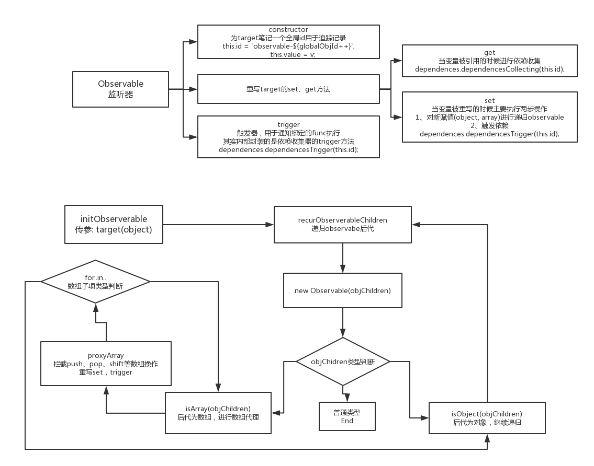
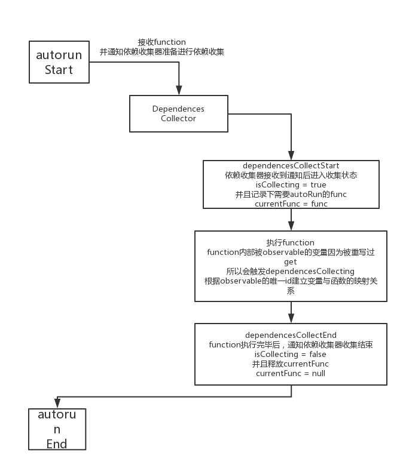
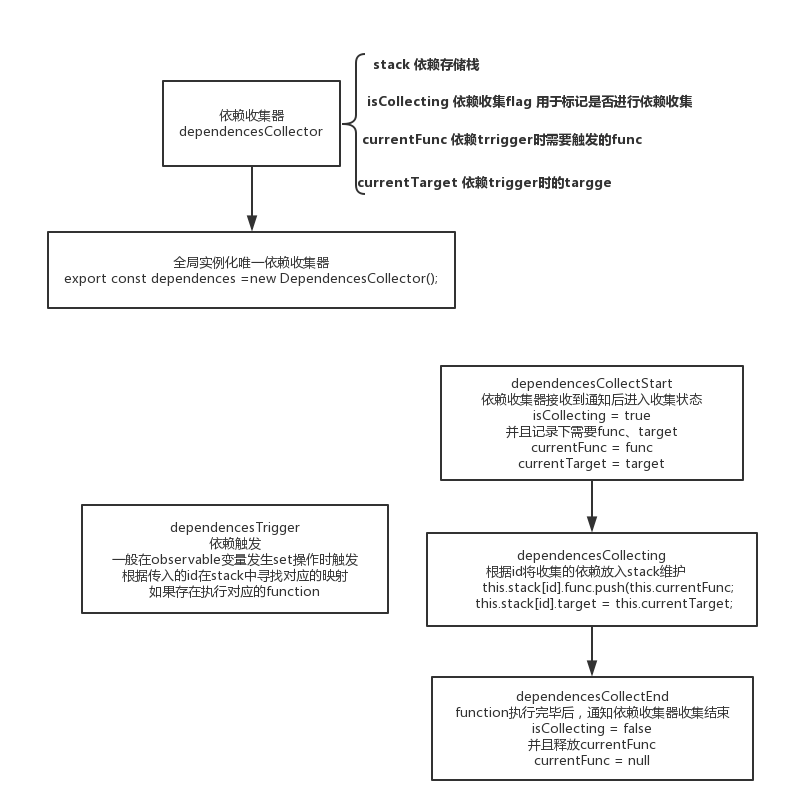

# mopx
## 关于mopx
mopx是对mobx的阉割版实现，提供`autorun`、`observable`、`computed`

## 原理解析
### observable
包装对象值的 Observable ，核心原理是 Object.defineProperty ，给被包装的属性套上 get 和 set 的钩子，在 get 中响应依赖收集，在 set 中触发监听函数。



### autorun
在执行 autorun(handler) 的时候会执行以下的代码（实际上也就这三句代码）：

```
dependences.dependencesCollectStart(func);
func();
dependences.dependencesCollectEnd();
```
这里 dependences 标记现在开始收集依赖，然后执行函数，执行结束之后，标记当前收集结束。


### computed
变种的autorun。

### dependencesCollector


## 运行测试用例
```
npm run test
```

## mopx借鉴过的资料
基于[@芋头君](https://github.com/xinyu198736)的[s-mobx](https://github.com/xinyu198736/s-mobx)进行复写改造，并且README.md中对mobx原理描述也截取了其中部分。

- [mobx官方源码](https://github.com/mobxjs/mobx)
- [如何自己实现一个 mobx - 原理解析](https://zhuanlan.zhihu.com/p/26559530)

在此特别感谢以上各位提供的帮助，感谢对开源社区的贡献！
